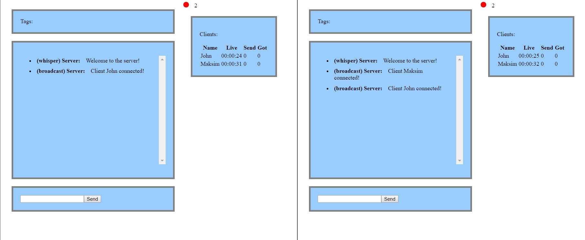

# SignalR Chat Client

Реализация группового чата с новостной рассылкой. Выполнено в качестве демонстрации возможностей SignalR.

Технологии (VS 2019 Solution):
1. ASP.NET SignalR на .NET Framework 4.6.1 (Server)
2. Vue.js TypeScript, запущенный с Node.js (Client)

### Требования

Для работы с приложением в среде Visual Studio требуется:
1. MS Windows IIS Express
2. Расширения VS: ASP.NET и node.js
3. .Net Framework 4.6.1
4. Выполнить обновление пакетов Nuget в SignalRChat и пакетов npm в SignalRChatClient

### Функционал

1. Чат с приватными, общими и групповыми сообщениями
2. Отслеживание подключенных пользователей и статистики их сообщений
3. Подписка на новостную ленту с ресурса (https://news.google.com/news/rss)

Список команд чата в клиенте:
* "message" - сообщение всем участникам
* /whisper "name" "message" - приватное сообщение пользователю "name"
* /subscribe "tag" - подписаться на новости, в заголовках которых есть слово "tag" 
* /unsubscribe "tag" - отписаться от новостей с тегом "tag" 
* /group "tag" "message" - групповое сообщение пользователям, подписанным на тег "tag"

### Пример работы

|||
|:--- | ---:|
|||
|||
